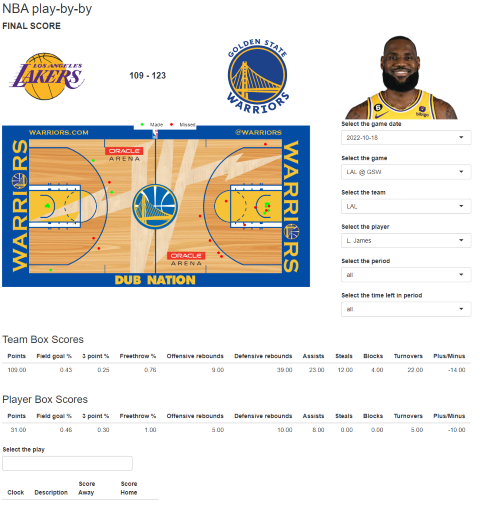
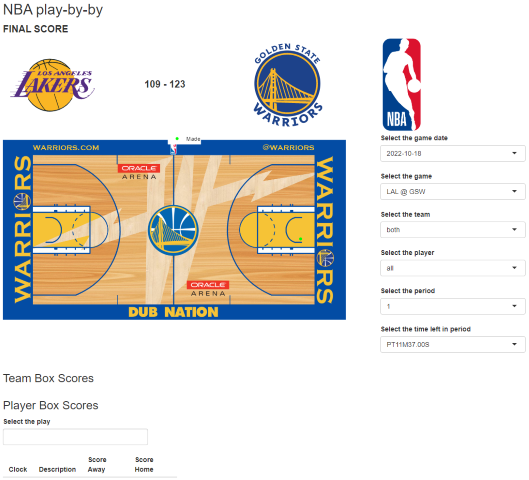

```{r, include = FALSE}
knitr::opts_chunk$set(
  collapse = TRUE,
  comment = "#>"
)
```

```{r setup}
library(play.by.play)
```

NBA play-by-play uses the NBA live play-by-play data from [NBA stats](https://www.nba.com/stats) to visualize the NBA games of the 2022-23 NBA season. 

Use the app by using the run run_NBA_pbp() function, which takes arguments for width and height.

```{r}

run_NBA_pbp()

```
For this, the app has two main functionalities.

First, visualizing an overview of the whole game. 
It is possible to filter the shots taken in the game by team, player, peroid and minutes left in the period.
Furthermore, the plot distinguishes between made shots (green) and missed shots(red).

## Full App


## Team and Player selected



## Period and minute left in period selected



Second, it is possible to click through the individual plays of the game in chronological order. In this case, A description of the play, the current score of the game and minutes left in the period are displayed in a table. If the current play is a shot attempt, the plot also shows the shot coordinated and shot result.

## Play-by-play


